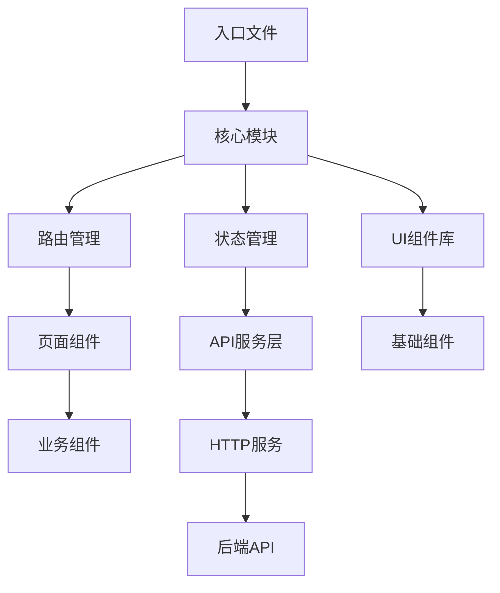
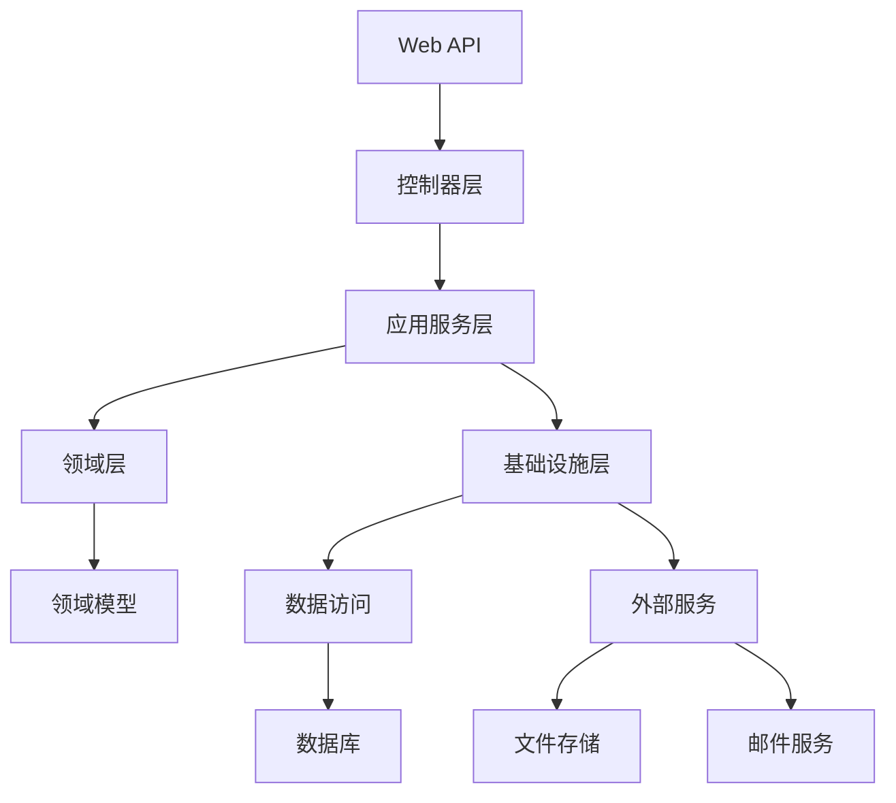
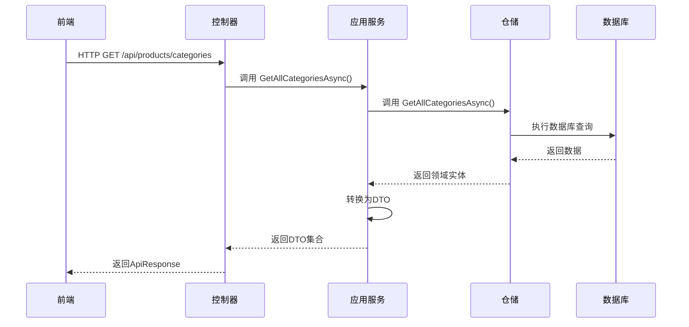

# IT设备回收官网分层架构设计

## 前端 Vue 3 分层架构

### 前端整体架构



### 详细分层结构

```
src/
├── api/                  # API服务层
│   ├── productApi.js     # 产品相关API
│   ├── caseApi.js        # 案例相关API
│   ├── authApi.js        # 认证相关API
│   ├── chatApi.js        # 聊天相关API
│   └── httpClient.js     # Axios封装
│
├── assets/               # 静态资源
│   ├── images/           # 图片资源
│   ├── fonts/            # 字体文件
│   └── styles/           # 全局样式
│       ├── variables.scss # 样式变量
│       ├── mixins.scss   # 混合样式
│       └── global.scss   # 全局样式
│
├── components/           # 通用组件
│   ├── common/           # 基础UI组件
│   │   ├── AppButton.vue
│   │   ├── AppCard.vue
│   │   └── AppIcon.vue
│   ├── layout/           # 布局组件
│   │   ├── AppHeader.vue
│   │   ├── AppFooter.vue
│   │   └── AppSidebar.vue
│   └── features/         # 功能组件
│       ├── chat/         # 聊天组件
│       │   ├── ChatWidget.vue
│       │   └── MessageBubble.vue
│       └── calculator/   # 计算器组件
│           └── ValueCalculator.vue
│
├── composables/          # 组合式函数
│   ├── useApi.js         # API调用封装
│   ├── useChat.js        # 聊天逻辑
│   └── useResponsive.js  # 响应式布局
│
├── router/               # 路由管理
│   ├── index.js          # 路由配置入口
│   ├── routes.js         # 路由定义
│   └── guards.js         # 路由守卫
│
├── store/                # 状态管理(Pinia)
│   ├── modules/          # 模块化store
│   │   ├── productStore.js  # 产品状态
│   │   ├── caseStore.js     # 案例状态
│   │   └── authStore.js     # 认证状态
│   └── index.js          # store主入口
│
├── utils/                # 工具函数
│   ├── validators.js     # 表单验证
│   ├── helpers.js        # 辅助函数
│   └── constants.js      # 常量定义
│
├── views/                # 页面组件
│   ├── HomeView.vue      # 首页
│   ├── AboutView.vue     # 公司介绍
│   ├── ProductsView.vue  # 产品类型
│   ├── CasesView.vue     # 案例展示
│   ├── ContactView.vue   # 联系我们
│   └── JobsView.vue      # 加入我们
│
├── App.vue               # 根组件
└── main.js               # 入口文件
```

## 后端 .NET 8 分层架构

### 后端整体架构



### 详细分层结构

```
ITAssetAPI/
├── Controllers/            # Web API控制器
│   ├── ProductsController.cs # 产品控制器
│   ├── CasesController.cs    # 案例控制器
│   ├── ChatController.cs     # 聊天控制器
│   └── JobsController.cs     # 招聘控制器
│
├── Application/            # 应用服务层
│   ├── Services/           # 应用服务实现
│   │   ├── ProductService.cs
│   │   ├── CaseService.cs
│   │   └── ChatService.cs
│   ├── DTOs/               # 数据传输对象
│   │   ├── ProductDTOs/
│   │   │   ├── ProductCategoryDto.cs
│   │   │   └── ProductDetailDto.cs
│   │   └── CaseDTOs/
│   │       ├── CaseSummaryDto.cs
│   │       └── CaseDetailDto.cs
│   ├── Mappings/           # 对象映射配置
│   │   └── AutoMapperProfile.cs
│   └── Validators/         # 验证逻辑
│       ├── ProductValidators/
│       └── CaseValidators/
│
├── Domain/                 # 领域层
│   ├── Entities/           # 领域实体
│   │   ├── Product/
│   │   │   ├── Product.cs
│   │   │   └── ProductCategory.cs
│   │   ├── Case/
│   │   │   ├── Case.cs
│   │   │   └── CaseImage.cs
│   │   └── Job/
│   │       ├── JobPosition.cs
│   │       └── JobApplication.cs
│   ├── Enums/              # 枚举类型
│   │   ├── ProductType.cs
│   │   └── CaseCategory.cs
│   ├── Events/             # 领域事件
│   │   └── ChatMessageReceivedEvent.cs
│   └── Services/           # 领域服务接口
│       ├── IProductEvaluationService.cs
│       └── IChatDomainService.cs
│
├── Infrastructure/         # 基础设施层
│   ├── Data/               # 数据访问
│   │   ├── ApplicationDbContext.cs # 数据库上下文
│   │   ├── Migrations/     # 数据库迁移
│   │   ├── Repositories/   # 仓储实现
│   │   │   ├── ProductRepository.cs
│   │   │   └── CaseRepository.cs
│   │   └── Seeders/        # 数据种子
│   │       └── DatabaseSeeder.cs
│   ├── FileStorage/        # 文件存储
│   │   ├── IFileStorageService.cs
│   │   └── LocalFileStorageService.cs
│   ├── Identity/           # 身份认证
│   │   ├── AuthService.cs
│   │   └── JwtService.cs
│   ├── Chat/               # 聊天服务
│   │   ├── Hubs/           # SignalR Hubs
│   │   │   └── ChatHub.cs
│   │   └── Services/
│   │       └── ChatHistoryService.cs
│   └── Email/              # 邮件服务
│       ├── IEmailService.cs
│       └── SmtpEmailService.cs
│
├── Common/                 # 公共模块
│   ├── Exceptions/         # 自定义异常
│   │   ├── ApiException.cs
│   │   └── NotFoundException.cs
│   ├── Helpers/            # 辅助类
│   │   └── FileHelper.cs
│   └── Responses/          # API响应模型
│       └── ApiResponse.cs
│
├── appsettings.json        # 配置文件
├── Program.cs              # 入口文件
└── Startup.cs              # 启动配置
```

## 关键分层说明

### 前端分层核心原则

1. **组件分层**：
   
   - 基础组件：无业务逻辑的纯UI组件
   - 业务组件：包含特定业务逻辑的组件
   - 页面组件：路由对应的完整页面

2. **状态管理**：
   
   ```javascript
   // store/modules/productStore.js
   import { defineStore } from 'pinia';
   import { fetchProductCategories } from '@/api/productApi';
   
   export const useProductStore = defineStore('product', {
     state: () => ({
       categories: [],
       currentProducts: [],
       loading: false,
       error: null
     }),
     actions: {
       async loadCategories() {
         this.loading = true;
         try {
           this.categories = await fetchProductCategories();
         } catch (err) {
           this.error = err.message;
         } finally {
           this.loading = false;
         }
       }
     },
     getters: {
       serverCategories: (state) => state.categories.filter(c => c.type === 'server')
     }
   });
   ```

3. **API服务封装**：
   
   ```javascript
   // api/httpClient.js
   import axios from 'axios';
   
   const apiClient = axios.create({
     baseURL: import.meta.env.VITE_API_BASE_URL,
     timeout: 10000,
     headers: {
       'Content-Type': 'application/json',
       'Accept': 'application/json'
     }
   });
   
   // 请求拦截器
   apiClient.interceptors.request.use(config => {
     const token = localStorage.getItem('auth_token');
     if (token) {
       config.headers.Authorization = `Bearer ${token}`;
     }
     return config;
   });
   
   // 响应拦截器
   apiClient.interceptors.response.use(
     response => response.data,
     error => {
       // 统一错误处理
       return Promise.reject(error.response?.data || error.message);
     }
   );
   
   export default apiClient;
   ```

### 后端分层核心原则

1. **领域驱动设计**：
   
   ```csharp
   // Domain/Entities/Product/Product.cs
   public class Product : BaseEntity
   {
       [Required]
       [StringLength(100)]
       public string Name { get; set; }
   
       [StringLength(500)]
       public string Description { get; set; }
   
       [Required]
       public ProductType Type { get; set; }
   
       // 处理流程步骤
       public ICollection<ProcessStep> ProcessSteps { get; set; } = new List<ProcessStep>();
   
       // 关联分类
       public int CategoryId { get; set; }
       public ProductCategory Category { get; set; }
   }
   ```

2. **应用服务层**：
   
   ```csharp
   // Application/Services/ProductService.cs
   public class ProductService : IProductService
   {
       private readonly IProductRepository _productRepository;
       private readonly IMapper _mapper;
   
       public ProductService(IProductRepository productRepository, IMapper mapper)
       {
           _productRepository = productRepository;
           _mapper = mapper;
       }
   
       public async Task<IEnumerable<ProductCategoryDto>> GetAllCategoriesAsync()
       {
           var categories = await _productRepository.GetAllCategoriesAsync();
           return _mapper.Map<IEnumerable<ProductCategoryDto>>(categories);
       }
   
       public async Task<ProductDetailDto> GetProductByIdAsync(int id)
       {
           var product = await _productRepository.GetByIdAsync(id);
           if (product == null) throw new NotFoundException("Product not found");
   
           return _mapper.Map<ProductDetailDto>(product);
       }
   }
   ```

3. **基础设施层**：
   
   ```csharp
   // Infrastructure/Data/Repositories/ProductRepository.cs
   public class ProductRepository : IProductRepository
   {
       private readonly ApplicationDbContext _context;
   
       public ProductRepository(ApplicationDbContext context)
       {
           _context = context;
       }
   
       public async Task<IEnumerable<ProductCategory>> GetAllCategoriesAsync()
       {
           return await _context.ProductCategories
               .Include(c => c.Products)
               .AsNoTracking()
               .ToListAsync();
       }
   
       public async Task<Product> GetByIdAsync(int id)
       {
           return await _context.Products
               .Include(p => p.Category)
               .Include(p => p.ProcessSteps)
               .FirstOrDefaultAsync(p => p.Id == id);
       }
   }
   ```

4. **控制器层**：
   
   ```csharp
   // Controllers/ProductsController.cs
   [ApiController]
   [Route("api/[controller]")]
   public class ProductsController : ControllerBase
   {
       private readonly IProductService _productService;
   
       public ProductsController(IProductService productService)
       {
           _productService = productService;
       }
   
       [HttpGet("categories")]
       [ProducesResponseType(typeof(ApiResponse<IEnumerable<ProductCategoryDto>>), StatusCodes.Status200OK)]
       public async Task<IActionResult> GetCategories()
       {
           var categories = await _productService.GetAllCategoriesAsync();
           return Ok(new ApiResponse<IEnumerable<ProductCategoryDto>>(categories));
       }
   }
   ```

## 分层交互流程示例



这种分层架构设计确保了：

1. 前后端职责分离，模块化清晰
2. 代码复用率高，维护成本低
3. 易于扩展和添加新功能
4. 测试友好，各层可独立测试
5. 符合现代Web应用最佳实践

开发时应严格遵循分层规则：

- 前端视图层只处理UI逻辑
- 后端控制器层只处理HTTP请求
- 业务逻辑集中在应用服务层
- 数据访问限制在基础设施层
- 领域层保持纯净的业务模型
