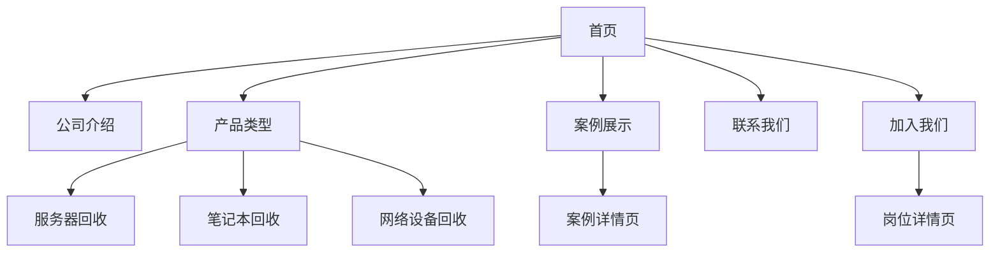
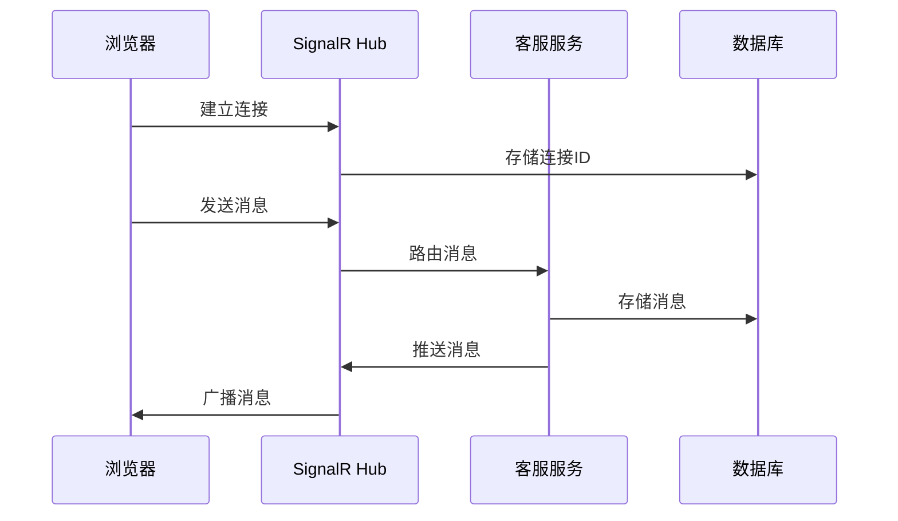
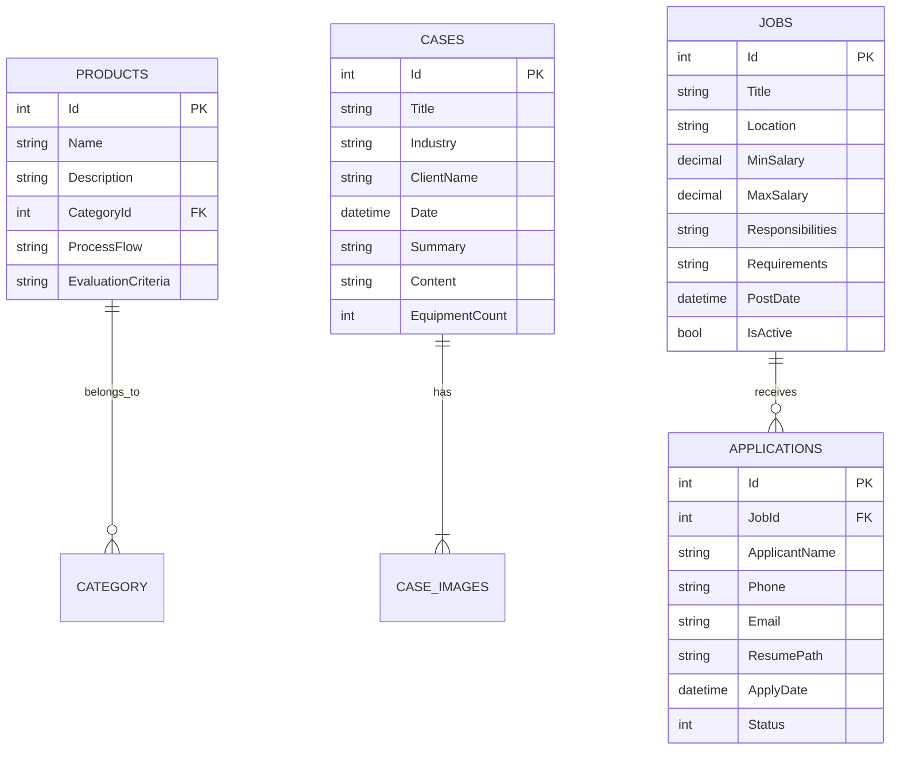

# IT设备回收服务企业官网项目需求文档

## 1. 项目概述

### 1.1 项目背景

为IT设备回收处置服务公司打造专业企业官网，展示公司服务能力与专业形象，建立客户沟通渠道，提升业务转化率。

### 1.2 项目目标

- 建立专业的企业形象展示平台
- 清晰展示服务产品与成功案例
- 提供便捷的客户咨询通道
- 支持人才招聘功能
- 响应式设计适配多终端

### 1.3 项目范围

- 前端：Vue 3 + TypeScript实现
- 后端：.NET 6 Web API
- 数据库：SQL Server 2019
- 实时通信：SignalR
- 部署环境：CentOS + Nginx + IIS

## 2. 功能需求

### 2.1 网站结构



### 2.2 页面详细需求

#### 2.2.1 首页

- 顶部导航栏：响应式设计，包含所有主要页面链接
- 轮播展示区：3-5张高质量业务展示图
- 核心业务摘要：卡片式布局展示主要服务
- 精选案例展示：3个最新/最成功案例
- 数据统计展示：动态计数器展示处理设备数量
- 底部全局信息：版权信息、联系方式、快速导航

#### 2.2.2 公司介绍页

- 公司发展历程：时间轴展示
- 资质证书展示：证书图片画廊
- 团队介绍：核心成员展示（照片+简介）
- 合作伙伴：合作伙伴LOGO展示区
- 环保理念：图文展示回收处理流程

#### 2.2.3 产品类型页

- 分类展示：服务器/笔记本/网络设备/存储设备/其他
- 每种产品展示：
  - 处理流程图解
  - 可回收设备型号列表
  - 回收价值评估标准
  - 环保处理技术说明
- 设备价值计算器：简易估价工具

#### 2.2.4 案例展示页

- 分类筛选：按行业/设备类型/处理规模
- 案例卡片：封面图+标题+摘要
- 案例详情页：
  - 客户背景介绍
  - 设备处理规模统计
  - 处理前后对比图
  - 客户证言
  - 环保效益数据展示

#### 2.2.5 联系我们页

- 联系表单：
  - 姓名
  - 电话
  - 邮箱
  - 公司名称
  - 咨询类型（下拉选择）
  - 设备类型（多选）
  - 预估数量
  - 留言内容
- 实时地图：高德地图API集成
- 联系信息卡片：
  - 服务热线（400电话）
  - 商务邮箱
  - 总部地址
  - 工作时间

#### 2.2.6 加入我们页

- 招聘岗位列表：
  - 岗位名称
  - 工作地点
  - 薪资范围
  - 发布日期
- 岗位详情页：
  - 岗位职责（带编号列表）
  - 任职要求（带编号列表）
  - 福利待遇
  - 申请按钮
- 申请表单：
  - 姓名
  - 联系方式
  - 应聘岗位
  - 简历上传（PDF/DOC/DOCX）
  - 个人简介

### 2.3 核心功能：在线咨询系统

#### 2.3.1 客户端功能

- 右下角悬浮咨询按钮
- 聊天窗口功能：
  - 实时消息显示
  - 表情符号支持
  - 文件传输（图片/文档，≤5MB）
  - 对话历史记录
  - 客服在线状态指示器
  - 自动问候语

#### 2.3.2 管理端功能

- 客服登录认证
- 实时对话界面
- 客户分配机制
- 常用回复模板
- 对话记录查询
- 离线消息管理
- 文件收发管理

#### 2.3.3 技术实现



### 2.4 后台管理系统

- 内容管理：
  - 首页轮播图管理
  - 公司信息编辑
  - 产品分类管理
  - 案例内容管理
- 招聘管理：
  - 岗位发布/下架
  - 简历管理
  - 应聘者状态跟踪
- 咨询管理：
  - 客服账号管理
  - 对话监控
  - 数据统计
- 表单管理：
  - 联系表单查看
  - 导出功能

## 3. 技术规范

### 3.1 前端技术栈

| 技术           | 版本    | 用途      |
| ------------ | ----- | ------- |
| Vue          | 3.3.x | 核心框架    |
| TypeScript   | 5.x   | 类型安全    |
| Pinia        | 2.x   | 状态管理    |
| Vue Router   | 4.x   | 路由管理    |
| Element Plus | 2.3.x | UI组件库   |
| Axios        | 1.x   | HTTP客户端 |
| SignalR      | 6.x   | 实时通信    |
| Three.js     | r159  | 3D设备展示  |
| ECharts      | 5.4.x | 数据可视化   |

### 3.2 后端技术栈

| 技术                 | 版本       | 用途      |
| ------------------ | -------- | ------- |
| .NET               | 6.0      | 核心框架    |
| Entity Framework   | Core 6.0 | ORM     |
| SignalR            | 6.0      | 实时通信    |
| JWT Authentication | 6.0      | 身份验证    |
| Swagger            | 6.0      | API文档   |
| AutoMapper         | 12.0     | 对象映射    |
| NLog               | 5.1.x    | 日志记录    |
| Dapper             | 2.0.x    | 高性能数据访问 |

### 3.3 数据库设计（核心表）



### 3.4 API接口规范

- RESTful设计风格
- 响应格式：
  
  ```json
  {
  "code": 200,
  "message": "Success",
  "data": {
    // 业务数据
  }
  }
  ```
- 错误代码标准化：
  - 400：请求参数错误
  - 401：未授权
  - 404：资源不存在
  - 500：服务器内部错误

## 4. 非功能性需求

### 4.1 性能要求

- 页面加载时间：≤2秒（首屏）
- API响应时间：≤500ms（95%请求）
- 支持200+并发用户
- 聊天消息延迟：≤1秒

### 4.2 安全要求

- HTTPS全站加密
- 用户数据加密存储
- SQL注入防护
- XSS攻击防护
- 文件上传类型限制
- 敏感操作日志记录

### 4.3 SEO优化

- 语义化HTML结构
- 动态路由静态化
- 标准meta标签配置
- XML站点地图
- 结构化数据标记

### 4.4 兼容性要求

- 浏览器兼容：Chrome, Firefox, Edge, Safari（最新2个版本）
- 移动端适配：iOS & Android主流设备
- 分辨率适配：1920px~320px宽度

## 5. 交付物清单

### 5.1 代码交付

- 前端Vue项目源码（含完整组件库）
- 后端.NET解决方案
- 数据库创建脚本
- 部署配置脚本

### 5.2 文档交付

- 技术设计文档
- API接口文档（Swagger）
- 数据库设计文档
- 系统部署手册
- 用户操作手册
- 运维监控指南

### 5.3 测试交付

- Jest单元测试报告
- Postman接口测试集
- Cypress端到端测试脚本
- 负载测试报告
- 安全扫描报告

## 6. 运维与监控

### 6.1 监控体系

- 应用性能监控：Application Insights
- 错误日志监控：Sentry
- 服务器监控：Zabbix
- 实时报警：邮件+短信通知

### 6.2 维护计划

- 每日自动备份（数据库+文件）
- 每周安全扫描
- 每月性能评估
- 每季度功能更新
